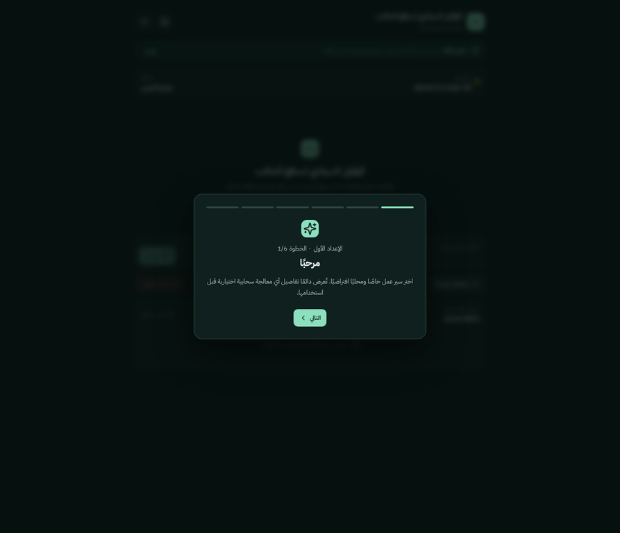

<div dir="rtl">

# المساعد الشخصي

> **مساعد شخصي مكتبي لنظام Windows يعمل محليًا أولًا.** التنفيذ المحلي هو المسار الافتراضي، أما الخدمات السحابية فهي اختيارية ولا تُستخدم إلا بعد اختيار المستخدم وموافقته الصريحة.

**المساعد الشخصي** هو شريط جانبي لنظام Windows يجمع واجهة Tauri وReact مع محرك FastAPI مُدار. صُمم للمستخدم الذي يريد مساعدًا محليًا عمليًا دون تشغيل Python أو Node.js أو Rust أو خادم backend يدويًا بعد التثبيت. يُعد Ollama محرك الاستدلال المحلي المفضّل، بينما تبقى الخدمات السحابية اختيارية ومحكومة بسياسة موافقة واضحة.



## تنزيل Windows وتثبيته

نزّل أحدث مثبت لنظام Windows 10/11 بمعمارية x64 من صفحة [الإصدارات](https://github.com/ynashat100-prog/sovereign-desktop-agent/releases)، ثم شغّل ملف `.exe` واتبع معالج التثبيت. الإصدار المصحح التالي هو [`v0.2.0`](https://github.com/ynashat100-prog/sovereign-desktop-agent/releases/tag/v0.2.0) بعد اكتمال بناء Windows المنشور.

| البند | التفاصيل |
| --- | --- |
| **ملف التثبيت للإصدار 0.2.0** | ملف NSIS باسم «المساعد الشخصي» يُنشر في صفحة الإصدار بعد نجاح بناء Windows |
| **النظام المدعوم** | Windows 10 أو Windows 11، بمعمارية x64 |
| **المطلوب من المستخدم العادي** | لا شيء إضافي لتشغيل التطبيق: لا Python ولا Node.js ولا Rust ولا Cargo ولا pnpm |
| **المضمن داخل الحزمة** | محرك Python/FastAPI الجانبي الذي يبدأ تلقائيًا مع التطبيق |
| **غير المضمن عمدًا** | Ollama ونموذج اللغة؛ يختارهما المستخدم وينزّلهما محليًا بإرادته |

> **تنبيه مهم:** وجود Ollama ونموذج محلي ليس شرطًا لفتح التطبيق أو الإعداد الأول أو الوضع التجريبي، لكنه ضروري للاستدلال المحلي الفعلي.

## مبادئ المنتج

| المبدأ | كيف يطبقه التطبيق |
| --- | --- |
| **الأمان أولًا** | يقبل المحرك أوامر الواجهة عبر توكن عشوائي خاص بكل تشغيل، ثم يفرض قائمة السماح ومحرك الصلاحيات؛ لا يملك النموذج أو صفحة ويب محلية تجاوزها. |
| **الخصوصية المحلية أولًا** | الوضع الافتراضي هو **محلي فقط**؛ فلا تُرسل النصوص أو الملفات أو لقطات الشاشة إلى أي مزود سحابي. |
| **موافقة سحابية صريحة** | الوضع الهجين يطلب اختيار مزود محدد وموافقة منفصلة لكل طلب قبل إرسال أي نص إلى السحابة. |
| **استمرار الاستخدام عند غياب المكونات** | غياب Ollama أو النماذج أو مفاتيح السحابة لا يمنع فتح الواجهة أو استخدام الإعداد أو السجل أو الوضع التجريبي. |
| **توزيع قابل للاستخدام** | ينتج مسار الإصدار مثبت NSIS لنظام Windows x64 يبدأ العملية الجانبية المضمنة تلقائيًا. |

## ما الذي يوفره التطبيق؟

التطبيق يقدم شريطًا جانبيًا بواجهة عربية أولًا، يدعم RTL وLTR والوضعين الفاتح والداكن. كما يوفر سجل تنفيذ حيًا عبر WebSocket، ومعالج إعداد أول، وزر إيقاف طارئ، ووضعًا تجريبيًا محليًا. تكتشف صفحة النماذج نماذج Ollama المثبتة، وتقترح `qwen2.5-coder:7b` و`qwen2.5-coder:14b`، وتقبل اسم أي نموذج Ollama آخر، ولا تبدأ تنزيل النموذج إلا بعد تأكيد المستخدم.

| المجال | القدرة المتاحة |
| --- | --- |
| **الاستدلال** | اكتشاف Ollama والتوليد المحلي واقتراحات Qwen والوضع التجريبي وتجريد موحد للمزودات السحابية المتوافقة مع OpenAI API. |
| **المزودات السحابية** | قوالب لـ NVIDIA NIM وMistral وGroq وxAI/Grok، مع إمكانية جلب قائمة النماذج المتاحة من رابط المزود ومفتاحه ثم حفظ النموذج المختار بأمان. |
| **حماية المفاتيح** | تُحفظ مفاتيح API في مخزن بيانات الاعتماد الخاص بنظام التشغيل؛ وعلى Windows يستخدم التطبيق Windows Credential Manager. لا تُحفظ المفاتيح في `.env` أو JSON أو Git أو السجل. |
| **وقت التشغيل** | نقاط HTTP من FastAPI وأحداث WebSocket وموجه حتمي وآلة حالات وزر إيقاف طارئ يتحكم فيه المستخدم. |
| **أدوات النظام** | عرض العمليات والتطبيقات المثبتة، وأدوات الملفات داخل مجلدات المحتوى الشخصية المسموحة، والحافظة، واللقطات المحلية، والتحكم المحدود في الصوت والسطوع وفتح صفحات إعدادات Windows، والبحث على الويب. يطلب كل فعل مؤثر تأكيدًا، وتبقى أوامر الطرفية والحذف معطلة افتراضيًا. |
| **الخصوصية** | لقطة الشاشة تحفظ محليًا بعد التأكيد ولا تُرسل إلى مزود سحابي عبر أداة اللقطة. لا تشمل هذه النسخة تحليلًا بصريًا أو جمعًا تلقائيًا للسياق. |
| **الذاكرة** | الذاكرة طويلة الأجل ليست ضمن واجهة هذا الإصدار؛ لا يعتمد التشغيل اليومي عليها. |

## البنية التقنية

```text
الشريط الجانبي: Tauri + React
              │ HTTP / WebSocket
              ▼
محرك الوكيل: FastAPI
              │
              ├── الموجه الذكي ──► Ollama (المسار المحلي الافتراضي)
              │       │
              │       └── وضع هجين بموافقة صريحة ──► مزود سحابي متوافق مع OpenAI
              │
              ├── آلة حالات + سجل حي
              ├── محرك صلاحيات ──► منفذ أدوات من قائمة سماح
              └── سجل تنفيذ حي عبر WebSocket
```

يشغّل غلاف Tauri محرك FastAPI باعتباره **عملية جانبية مضمّنة**؛ أي إن مثبت Windows يحتوي الملف التنفيذي اللازم ويبدأه التطبيق من دون أن يطلب من المستخدم تشغيل خادم يدويًا. يدعم Tauri هذا الأسلوب للملفات التنفيذية الخارجية، مع اشتراط اسم لاحقة هدف البناء للملف المضمّن.[1]

## Ollama والنماذج المحلية

بعد تثبيت التطبيق، افتح معالج الإعداد. إذا كان Ollama مثبتًا ويعمل، اختر **Qwen2.5-Coder 7B** للأجهزة الأقل قدرة أو **Qwen2.5-Coder 14B** لجهاز أقوى مثل RTX 3060 بذاكرة 12 GB. يمكنك بدلًا من ذلك اختيار نموذج مثبت مسبقًا أو كتابة اسم نموذج Ollama مختلف. عندما لا يكون النموذج متاحًا، يعرض التطبيق زر **تنزيل النموذج** ويطلب تأكيدًا قبل بدء التنزيل المحلي، ثم يعرض التقدم في السجل الحي.

## أوضاع الخصوصية

| الوضع | ما الذي قد يعمل؟ | ما الذي قد يغادر الجهاز؟ |
| --- | --- | --- |
| **محلي فقط** | Ollama والأدوات المحلية عند توافرها. | لا شيء يُرسل إلى مزود سحابي. |
| **هجين** | يظل الاستدلال المحلي هو المفضل، ويمكن اختيار مزود سحابي محدد للطلب. | نص الطلب المحدد فقط، وبعد إفصاح يحدد اسم المزود والنموذج وموافقة المستخدم. تتطلب لقطات الشاشة موافقة مستقلة إضافية. |
| **تجريبي** | الواجهة والمحادثة المحاكية والسجل والإعدادات. | لا شيء؛ لا يلزم وجود مزود نموذج. |

## المزودات السحابية ومفاتيح API

تحتوي لوحة المزودات على قوالب لـ NVIDIA NIM وMistral وGroq وxAI/Grok، إضافة إلى نموذج عام متوافق مع OpenAI. أدخل اسم المزود ورابط **HTTPS** الأساسي ومفتاح API، ثم استخدم زر **جلب النماذج المتاحة** لاختيار نموذج يعلن عنه المزود قبل الحفظ. لا يُكتب المفتاح المحفوظ في `.env` أو JSON أو SQLite أو السجلات أو Git؛ بل يحتفظ التطبيق ببيانات وصفية غير سرية فقط ويسترجع المفتاح من مخزن نظام التشغيل عند الحاجة.

يرفض المحرك أي طلب سحابي ما لم يكن الوضع **هجينًا**، والمزود مسمىً صراحة، والموافقة موجودة للطلب نفسه. لا يملك النموذج حق تجاوز محرك الصلاحيات أو تنفيذ أداة سحابية بمفرده.

## صلاحيات الأدوات

| المستوى | أمثلة | السلوك الافتراضي |
| --- | --- | --- |
| **آمن** | قراءة ملف نصي محدود، البحث في مجلد محدد، عرض بيانات عملية محدودة وقائمة التطبيقات المثبتة. | يُنفذ عبر قائمة السماح. |
| **يتطلب تأكيدًا** | كتابة أو إنشاء ملف أو مجلد، فتح مسار أو تطبيق، قراءة/كتابة الحافظة، لقطة شاشة محلية، بحث ويب، وتغيير الصوت أو السطوع أو فتح صفحة إعدادات معتمدة. | يظهر طلب موافقة يذكر الأداة المطلوبة. |
| **خطِر** | الحذف الدائم للملفات أو المجلدات، وأوامر الطرفية. | معطل في الإعدادات افتراضيًا، ولا يصبح مسموحًا لمجرد أن النموذج طلبه. |

لا يشمل النطاق الحالي تعديل Registry أو رفع الصلاحيات الإدارية أو إيقاف الجهاز أو تنفيذ الطرفية بلا قيود. لقطة الشاشة تُحفظ محليًا فقط ولا تُرسل إلى مزود سحابي عبر أداة اللقطة. زر **إيقاف الوكيل** يلغي التنفيذ الجاري ويمسح طلبات الموافقة المعلقة ويمنع بقية الخطوات في تلك المهمة.

## التشغيل للمطورين فقط

الأوامر التالية مخصصة للمساهمين؛ **لا يحتاج إليها** مستخدم مثبت Windows.

```bash
git clone https://github.com/ynashat100-prog/sovereign-desktop-agent.git
cd sovereign-desktop-agent
cp .env.example .env

# المحرك الخلفي
cd backend
python -m venv .venv
# في Windows PowerShell: .\.venv\Scripts\Activate.ps1
# في Bash: source .venv/bin/activate
pip install -e ".[dev]"
python run.py
```

في طرفية أخرى، شغّل واجهة React:

```bash
cd frontend
pnpm install
pnpm dev
```

ولتجربة غلاف سطح المكتب المدمج، ابنِ العملية الجانبية على نظام التشغيل نفسه المستهدف ثم شغّل Tauri:

```bash
# من جذر المستودع
python scripts/build_backend.py
cd frontend
pnpm tauri:dev
```

## الاختبارات والبناء

نفّذ فحوصات المحرك الخلفي والواجهة قبل إرسال تعديل للمراجعة:

```bash
cd backend
ruff check app tests
pytest -q

cd ../frontend
pnpm build
```

يجري سير عمل [Windows Release](.github/workflows/windows-release.yml) النشط على GitHub Actions الفحوصات التالية على `windows-latest`: تدقيق واختبارات backend، وبناء Python sidecar والتحقق من `/health`، وتدقيق الواجهة، وبناء Tauri، وإنتاج مثبت NSIS ورفعه Artifact. عند دفع وسم يبدأ بـ `v` ينشر السير العمل نفسه ملف `.exe` في GitHub Release.

### بناء مثبت Windows x64 محليًا

المسار المدعوم للإصدار هو Windows 10/11 x64. على جهاز Windows للتطوير أو Windows CI ثبّت متطلبات Tauri المعتادة، ثم نفّذ:

```powershell
# من جذر المستودع
py -m pip install -e ".\backend[dev]"
py .\scripts\build_backend.py
cd .\frontend
pnpm install --frozen-lockfile
pnpm exec tauri build --target x86_64-pc-windows-msvc
```

يُنتج مثبت NSIS داخل مجلد حزمة الإصدار الخاص بـ Tauri. ويعد NSIS صيغة توزيع Windows مدعومة من Tauri، كما أن بناء Windows في بيئة Windows أو CI هو المسار المفضل.[2]

## هيكل المستودع

```text
backend/                 محرك الوكيل: FastAPI والنماذج والمزودات والأدوات والاختبارات
frontend/                واجهة React وغلاف Tauri والقدرات وإعداد حزمة Windows
scripts/                 سكربتات بناء العملية الجانبية والأيقونات
assets/                  أيقونة التطبيق ومعاينة الواجهة
docs/                    توثيق التحقق والتصميم
```

## القيود الحالية

هذا مشروع MVP وليس ادعاءً بتوافر كل تكامل اختياري على كل جهاز. لا تتضمن هذه النسخة رؤية أو ذاكرة طويلة الأجل؛ تلتقط أداة الشاشة صورة محلية فقط بعد موافقة صريحة. يقتصر التحقق الآلي على تشغيل العملية الجانبية وفحص صحتها وبناء الحزمة على `windows-latest`؛ لذلك يُوصى دائمًا بإجراء تثبيت تفاعلي يدوي على Windows 10 أو 11 قبل توزيع نسخة واسعة لمستخدمين نهائيين.

## المساهمة والرخصة

اقرأ [دليل المساهمة](CONTRIBUTING.md) قبل فتح Pull Request. لا تلتزم أبدًا بالمفاتيح أو ملفات `.env` أو النماذج المنزلة أو البيئات الافتراضية أو `node_modules` أو قواعد البيانات أو المثبتات المترجمة.

هذا المستودع منشور برخصة [MIT](LICENSE).

## المراجع

[1]: https://v2.tauri.app/develop/sidecar/ "Tauri v2: Embedding External Binaries"
[2]: https://v2.tauri.app/distribute/windows-installer/ "Tauri v2: Windows Installer"

</div>
